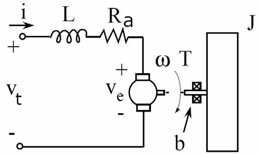
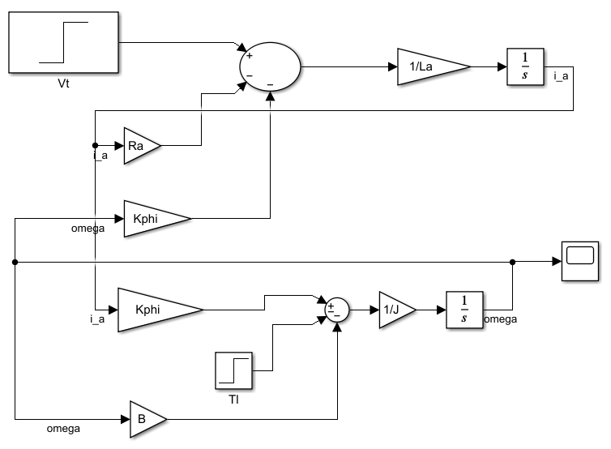
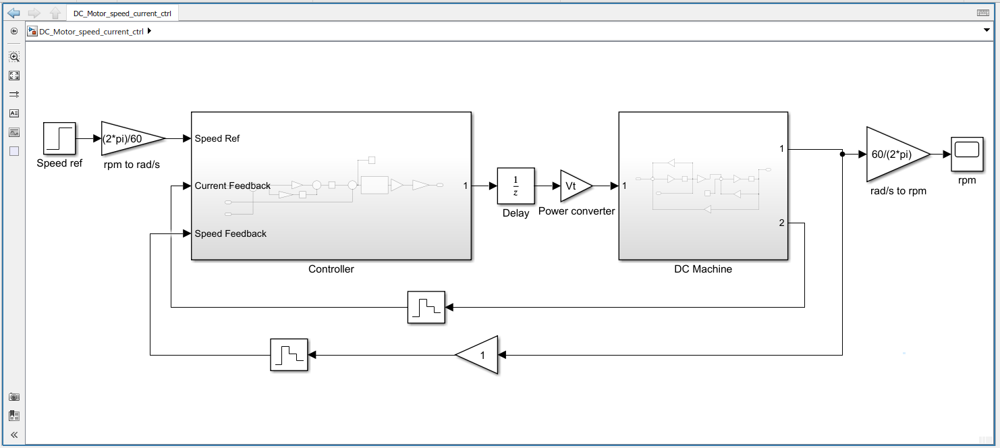
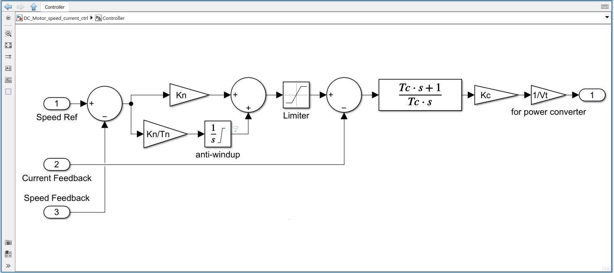

Table of contents
- [1. DC motor](#1-dc-motor)
- [2. Matlab Simulink of DC machine model](#2-matlab-simulink-of-dc-machine-model)
- [3. DC machine controller](#3-dc-machine-controller)
- [State space](#state-space)

# 1. DC motor 
:warning: This is model with mechanical load and realistic electrical properties (RL) ([^ref1], lecture note 05)



**Equation of motion - Electrical**

Using Kirchhoff’s Voltage Law
<p align="center"></p>
or

<p align="center"></p>

**Equation of motion - Mechanical**

Torque balance yield
<p align="center"></p>

where
-  inductance due to windings
-  dissipation (resistance of windings)
-  dissipation (friction coefficient in motor bearings)
-  moment of load inertia
-  torque constant
-  is torque developed by rotor.
-  back EMF constant
-  load torque (motor need to generate torque to overcome this load torque)

We are going to use equation `(1)` and equation `(2)` for Matlab Simulink simulation.

# 2. Matlab Simulink of DC machine model

Now, let take a close look at [DC machine model](DCMachine.slx) and [calculation file](DC_Motor_speed_current_ctrl_cal.m).

```matlab
Ra = 7;
La = 120e-3;
Kphi = 1.41e-2 ; % V/(rad/s)
J = 1.06e-6;
B = 6.03e-6;
Vt = 6;
Tl = 3.53e-3;
% omega should be 248.56
```

In steady state,  and  we have

<p align="center"></p>

<p align="center"></p>

so,

<p align="center"></p>

|     |
| :----------------------------------------------------: |
|            Matlab Simulink DC machine model            |
|  |
|                   Rotor speed result                   |

Rotor speed at the steady state is calculated using `equation (5)`. In this case , it is confirmed by the simulation output.


# 3. DC machine controller
:warning: This part is in progress

We are going to design controller for the DC machine above. THe overall DC machine speed controller is illustrated as following [^ref2]

|  |
| :------------------------------------------------------------------: |
|             Overall DC cascaded speed controller system              |

Let take a look at [DC machine speed and current controller](DC_Motor_speed_current_ctrl.slx) and [DC machine calculation](DC_Motor_speed_current_ctrl_cal.m).

|  |
| :----------------------------------------------------------------------: |
|                         Overall simulation model                         |
|     |
|                  Current and speed cascaded controller                   |
|  |
|                   The simulation result of rotor speed                   |

# State space

:warning: This part is in progress

https://ctms.engin.umich.edu/CTMS/index.php?example=MotorSpeed&section=SystemModeling

**References**

[^ref1]: Franz Hover, David Gossard, and George Barbastathis. *2.004 Systems, Modeling, and Control II.* Fall 2007. Massachusetts Institute of Technology: MIT OpenCourseWare, [https://ocw.mit.edu](https://ocw.mit.edu/courses/mechanical-engineering/2-004-systems-modeling-and-control-ii-fall-2007). License: [Creative Commons BY-NC-SA](https://creativecommons.org/licenses/by-nc-sa/4.0/).  
[^ref2]: Dey, S., Malakar, S. & Panda, M. 2015. Design of Optimized Speed Controller of DC Motor Using Chopper [Online]. Available: https://www.ijser.in/archives/v3i6/IJSER15245.pdf [Accessed February 10, 2022].
