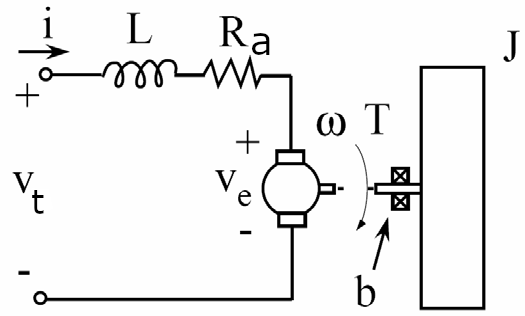

# DC motor 
:warning: This is model with mechanical load and realistic electrical properties (RL) ([^ref1], lecture note 05)

**Equation of motion - Electrical**

Using Kirchhoff’s Voltage Law
$$
v_s - v_L - v_R - v_e = 0
$$
or

$$
v_s - L \frac{di}{dt} - Ri - K_v \omega = 0 \quad (1)
$$

**Equation of motion - Mechanical**

Torque balance yield
$$
J \frac{d \omega}{dt} = K_m i - T_L - b \omega \quad (2)
$$

where
- $L$ inductance due to windings
- $R$ dissipation (resistance of windings)
- $b$ dissipation (friction coefficient in motor bearings)
- $J$ moment of load inertia
- $K_m \equiv 2BNLr$ torque constant
- $K_m i$ is torque developed by rotor.
- $K_v \equiv 2BNLr$ back EMF constant
- $T_L$ load torque (motor need to generate torque to overcome this load torque)

We are going to use equation `(1)` and equation `(2)` for Matlab Simulink simulation.

[^ref1]: Franz Hover, David Gossard, and George Barbastathis. *2.004 Systems, Modeling, and Control II.* Fall 2007. Massachusetts Institute of Technology: MIT OpenCourseWare, [https://ocw.mit.edu](https://ocw.mit.edu/courses/mechanical-engineering/2-004-systems-modeling-and-control-ii-fall-2007). License: [Creative Commons BY-NC-SA](https://creativecommons.org/licenses/by-nc-sa/4.0/).
