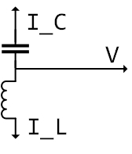
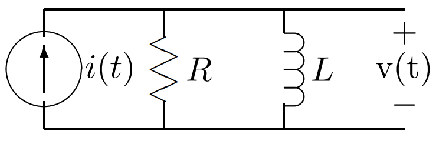
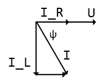

Table of contents
- [1. Sinusoidal time functions and complex number](#1-sinusoidal-time-functions-and-complex-number)
  - [1.1. Complex number recap [^ref1]](#11-complex-number-recap-ref1)
  - [1.2. Sinusoidal Time Functions](#12-sinusoidal-time-functions)
  - [1.3. Summary](#13-summary)
- [2. Impedance](#2-impedance)
  - [Example](#example)

## 1. Sinusoidal time functions and complex number

### 1.1. Complex number recap [^ref1]

Magnitude and phase angle of the complex number $\underline{z}$ is

$$
|\underline{z}|=\sqrt{x^{2}+y^{2}} \qquad 
\phi=\arctan \left(\frac{y}{x}\right)
$$

`Euler` relation

$$
e^{j \phi}=\cos (\phi)+j \sin (\phi) \qquad 
\underline{z}=x+j y=|\underline{z}| e^{j \phi}
$$

The product and the ratio of two complex numbers are

$$
\underline{z}_{1}=\left|\underline{z}_{1}\right| e^{j \phi_{1}} \qquad
\underline{z}_{2}=\left|\underline{z}_{2}\right| e^{j \phi_{2}}
\qquad
\underline{z}_{1} \underline{z}_{2}=\left|\underline{z}_{1}\right|\left|\underline{z}_{2}\right| e^{j\left(\phi_{1}+\phi_{2}\right)}
\qquad
\frac{\underline{z}_{1}}{\underline{z}_{2}}=\frac{\left|\underline{z}_{1}\right|}{\left|\underline{z}_{2}\right|} e^{j\left(\phi_{1}-\phi_{2}\right)}
$$

The complex conjugate of a complex number is given by

$$
\underline{z}=x+j y
\quad
z^{*}=x-j y
\qquad
\underline{z}+\underline{z}^{*}=2 \operatorname{Re}(\underline{z})=2 x
\qquad
\underline{z}-\underline{z}^{*}=2 j \operatorname{Im}(\underline{z})=2 j y
$$

### 1.2. Sinusoidal Time Functions

A sinusoidal function of time might be written in three ways

$$
f(t)=A \cos (\omega t+\phi) \qquad (1)
$$

$$
f(t)=B \cos (\omega t)+C \sin (\omega t) \qquad (2)
$$

$$
f(t)=\underline{X} e^{j \omega t}+\underline{X}^{*} e^{-j \omega t} \qquad (3)
$$

Equation `(3)` makes sure that that the resulting function is real. Now, let find out the relationship between equation `(1) and (3)`.

Let say

$$
\underline{X}=|\underline{X}| e^{j \psi}
$$

then
$$
f(t) =|\underline{X}| e^{j \psi} e^{j \omega t}+|\underline{X}|^{*} e^{-j \psi} e^{-j \omega t} =|\underline{X}| e^{j(\psi+\omega t)}+|\underline{X}|^{*} e^{-j(\psi+\omega t)}
$$

$$
f(t)=2|\underline{X}| \cos (\omega t+\psi)
$$

so we have

$$
|\underline{X}| =\frac{A}{2} \qquad \psi =\phi
$$

Next, finding the relationship between equation `(2) and (3)`.

Alternatively, we could write

$$
\underline{X}=x+j y 
\qquad \text{where} \quad
x=|\underline{X}| \cos (\psi)
\qquad
y=|\underline{X}| \sin (\psi)
$$

thus

$$
f(t)=\underline{X} e^{j \omega t}+\underline{X}^{*} e^{-j \omega t} = x\left(e^{j \omega t}+e^{-j \omega t}\right)+j y\left(e^{j \omega t}-e^{-j \omega t}\right)
$$

$$
f(t) =2 x \cos (\omega t)-2 y \sin (\omega t)
$$

Finally, we get

$$
B = 2x \qquad C = -2y \qquad \underline{X} = \frac{B}{2} - j \frac{C}{2}
$$

### 1.3. Summary 

While, expression `(3) and (4)` are equivalent since $(\underline{X} e^{j \omega t})^{*} = \underline{X}^{*} e^{-j \omega t}$, it is advantageous to use one or the other of
them, according to circumstances.  
It's easy to notice that $\underline{X}$ is time-independent. This conclusion is used when forming the relationship between voltage and current of inductor and capacitor elements.

| Sinusoidal form                            | Complex number form                                                                 | $\underline{X}$                       |
| ------------------------------------------ | ----------------------------------------------------------------------------------- | ------------------------------------- |
| $f(t)=A \cos (\omega t+\phi)$              | $f(t)=\underline{X} e^{j \omega t}+\underline{X}^{*} e^{-j \omega t} \quad (3)$     | $\underline{X}={A}/{2} \angle \phi$   |
| $f(t)=B \cos (\omega t)+C \sin (\omega t)$ | $f(t)=Re(2\underline{X} e^{j \omega t}) = Re(A e^{j \phi} e^{j \omega t})\quad (4)$ | $\underline{X} = {B}/{2} - j {C}/{2}$ |

**Strategy**
1. Transform the input `In` into complex polar form $In \angle \phi$
2. Calculate impedance complex number $Z$
3. Transform output `Out` into polar form $O \angle \alpha$
4. Using expression `(4)` to find out $Out(t)$

## 2. Impedance
Consider two elements, inductances and capacitances.

| Inducatance    (L)                                                                                                           | Capacitance (C)                                                                                                                   |
| ---------------------------------------------------------------------------------------------------------------------------- | --------------------------------------------------------------------------------------------------------------------------------- |
|                                                                                       |                                                                                           |
| Current is `lagging` voltage. (`L` means _Lower_ :arrow_lower_right:)                                                        | Current is `leading` voltage                                                                                                      |
| $v_L = L {di}/{dt}$                                                                                                          | $i = C \; {dV_C}/{dt}$                                                                                                            |
| $v = \underline{V}e^{j \omega t} + \underline{V}^{*} e^{-j \omega t}$                                                        | $i = \underline{I}e^{j \omega t} + \underline{I}^{*} e^{-j \omega t}$                                                             |
| $\underline{V}=j \omega L \underline{I} = \underline{Z}_L \; \underline{I} \quad \text{where } \underline{Z}_L = j \omega L$ | $\underline{I}=j \omega C \underline{V} = \underline{V} / \underline{Z}_C \quad \text{where } \underline{Z}_C = 1 / (j \omega C)$ |

The inverse of impedance is **admittance**

$$
\underline{Y} = 1/ \underline{Z}
$$

### Example
Suppose we are to find the voltage $v(t)$ in the network, in which $i(t) = I cos(\omega t)$

`Step 1.` Transform the input `In` into complex polar form $In \angle \phi$

$$
i(t) = Re(I e^{\omega t})
$$

`Step 2.` Calculate impedance complex number 
$$
Z \| = \frac{R j \omega L}{R + j \omega L} = \frac{R \omega L}{\sqrt{R^2 + (\omega L)^2}} \angle (arctan \frac{R}{\omega L})
$$

`Step 3. ` We found the output voltage in the polar-exponential form

$$
V = Z \| I = \frac{IR \omega L}{\sqrt{R^2 + (\omega L)^2}} \angle (arctan \frac{R}{\omega L})
$$

`Step 4.` Using expression `(4)` to find out $v(t)$

$$
v(t) = \frac{IR \omega L}{\sqrt{R^2 + (\omega L)^2}} cos ( \omega t + arctan \frac{R}{\omega L})
$$

**References**

[^ref1]: James Kirtley Jr.. *6.061 Introduction to Electric Power Systems.* Spring 2011. Massachusetts Institute of Technology: MIT OpenCourseWare, [https://ocw.mit.edu](https://ocw.mit.edu/courses/electrical-engineering-and-computer-science/6-061-introduction-to-electric-power-systems-spring-2011). License: [Creative Commons BY-NC-SA](https://creativecommons.org/licenses/by-nc-sa/4.0/).