Table of contents
- [Principle term of motion](#principle-term-of-motion)
  - [Kinetic energy](#kinetic-energy)
  - [Torque](#torque)
    - [Definition of torque](#definition-of-torque)
    - [Newton's second law for rotation](#newtons-second-law-for-rotation)
  - [Basic rules](#basic-rules)
  - [Summary](#summary)
- [DC machine directory](#dc-machine-directory)
- [AC machine definition](#ac-machine-definition)
- [Induction machine directory](#induction-machine-directory)
  - [Wound rotor](#wound-rotor)
  - [Cage rotor](#cage-rotor)
  - [Synchronous machine](#synchronous-machine)

Click :arrow_forward: icon to expand the content inside.

# Principle term of motion

    
What is kinetic energy?

## Kinetic energy

​**Kinetic energy** of an object is the energy that it possesses due to its motion.

**Rotational kinetic energy** is the energy associated with rotational motion, the same as kinetic energy in translational motion.

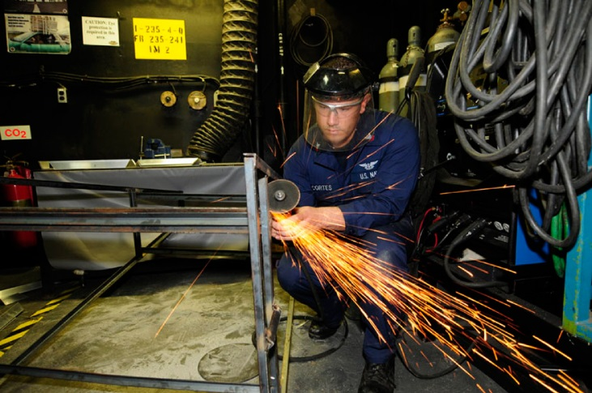

Every point on a rotating body has different **tangential** velocity . We find the equation for kinetic energy

We can divide up any body into a large number of smaller masses  and distance to the axis of rotation 

We want this equation in the form of kinetic energy (). That is why **moment of inertia**  was introduced.

Finally, we have

 What is torque? 

## Torque

**Torque** is the turning effectiveness of a force, and it is illustrated here for door rotation on its hinges [^ref1].

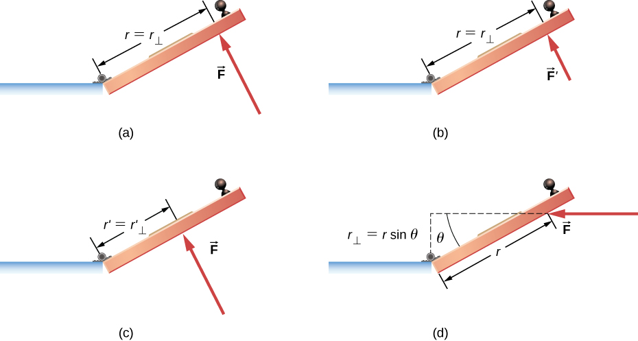

(a) A couterclockwise torque is produced by a force  acting at a distance  from the hingles.

(b) A smaller couterclockwise torque is produced when a smaller force  at the same distance .

(c) The same force as in (a) produces a smaller couterclockwise torque when applied at a smaller distance  from the hingles.

(d) A smaller counterclockwise torque is produced by same **magnitude** force as (a) at the same distance  but at an angle 

### Definition of torque 
When a force  is applied to a point P whose position is  relative to , the torque  around  is

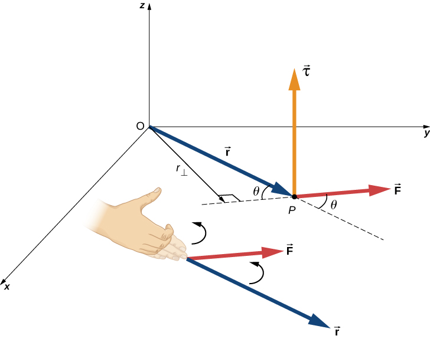

From the definiton of the **cross product**, the direction of torque is determined by **right hand** rule, and torque has magnitude

### Newton's second law for rotation

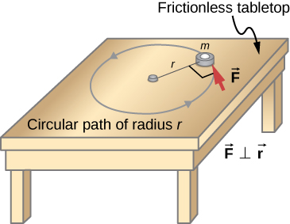

Recall that the magnitude of the **tangential** acceleration is proportional to the magnitude of the angular acceleration  by 

Multiple both side of above equation with , we have

Substitude the moment of inertia  and torque , we have

 Faraday law and Lorentz law 

## Basic rules

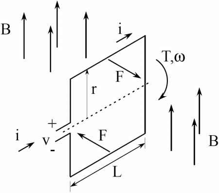

**Faraday law** (generator action): moving coil in a magnetic field ==> electromotive force (back EMF - )

or

**Lorentz law** (motor action): magnetic field applies force to a current.

or

where
-  velocity of the coil
-  number of coil
-  back EMF
-  torque constant
-  back EMF constant

 What is shear stress 

There are two ways to come up with the machine torque equation, one is through `Lorentz force` and another is `shear stress` [^ref3]. In [^ref2] course note, the author used shear stress to describe the torque. When deforming forces act tangentially to the object's surface, we call them 'shear' forces and the stress they cause is called **shear stress** [^ref1].  
Shear stress is due to forces that act parallel to the surface. We use the symbol  for such forces. The magnitude per surface area A where shearing force is applied is the measure of shear stress

so,

The air-gap also has a physical length `l`. Total developed torque  is force over the surface area times radius `r`

## Summary

| Name                               | Rotational                   | Linear          | Relationship         |
| ---------------------------------- | ---------------------------- | --------------- | -------------------- |
| Position                           |                      | x               |        |
| Accelation                         |                      |            |  |
| Velocity                           |                      |            |    |
| Moment of inertia / mass           |  | m               |                      |
| Kinetic energy                     |            |    |                      |
| Newton's second law (torque/Force) |                |         |                      |
| Power                              |                |  |                      |

# [DC machine directory](DC-machine/)
- Model of DC machine
- Speed control of DC machine

# AC machine definition

There are two major classes of ac machines: synchronous machines and induction machines.
1.  **Synchronous** machines are motors and generators whose magnetic field current is supplied by a separate DC power source (Chapter 4,5)
2.  **Induction** machines are motors and generators whose field current is supplied by magnetic induction (transformer action) into their field windings. (Chapter 6)
    1.  The rotor voltage (which produces the rotor current and the rotor magnetic field) is induced in the rotor windings rather than being physically connected by wires.
    2.  The distinguishing feature of an induction motor is that no DC field current is required to run the machine.
    3.  Although it is possible to use an induction machine as either a motor or a generator, it has many disadvantages as a generator and so is rarely used in that manner. For this reason, induction machines are usually referred to as induction motors.
The field circuits of most synchronous and induction machines are located on their rotors.

Induction motor stator looks (and is) the same as a synchronous machine stator.

# [Induction machine directory](Induction-machine/)
- Model of induction machine in Stator reference frame
- Model of induction machine in Rotor flux oriented reference fram (for Field-Oriented Control)
  
[How does an Induction Motor work ?](https://youtu.be/AQqyGNOP_3o)

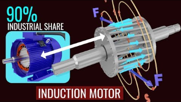
There are two different types of induction motor rotors which can be placed inside the stator. One is called a **cage rotor**, while the other is called a **wound rotor**.
[Understanding electric motor Windings!](https://youtu.be/YYQayMrK4Fo)

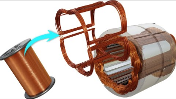

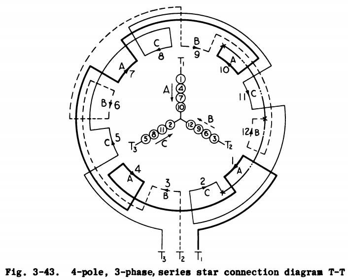
Page (136 / 812) ref#10

## Wound rotor
[Slip ring Induction Motor, How it works ?](https://youtu.be/JPn5Ou-N0b0)

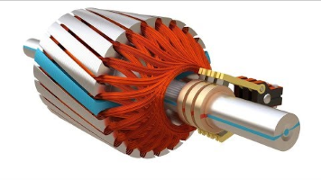
- A wound rotor has a complete set of three-phase windings that are similar to the windings on the stator
- The three phases of the rotor windings are usually Y-connected, and the ends of the three rotor wires are tied to slip rings on the rotor's shaft. The rotor windings are shorted through brushes riding on the slip rings
- Wound-rotor induction motors are more expensive than cage induction motors, and they require much more maintenance because of the wear associated with their brushes and slip rings. As a result, wound-rotor induction motors are rarely used.

## Cage rotor

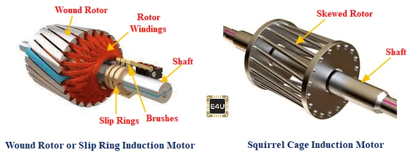

[SLIP RING MOTOR - how it works, explained the EASY way! (1920s Lift Motor Room)](https://youtu.be/W1mee2uNFiE)

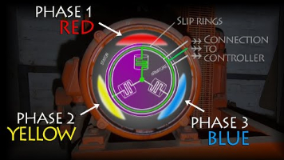

## Synchronous machine
[Working of Synchronous Motor](https://youtu.be/Vk2jDXxZIhs)

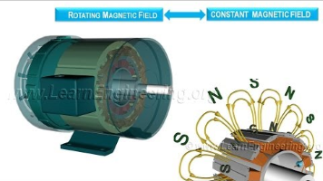

**References**

[^ref1]: Moebs, W., Ling, S. J. & Sanny, J. Sep 19, 2016. University Physics Volume 1 [Online]. Houston, Texas: OpenStax. Available: https://assets.openstax.org/oscms-prodcms/media/documents/UniversityPhysicsVol1-WEB.pdf [Accessed January 28, 2022].
[^ref2]: Franz Hover, David Gossard, and George Barbastathis. *2.004 Systems, Modeling, and Control II.* Fall 2007. Massachusetts Institute of Technology: MIT OpenCourseWare, [https://ocw.mit.edu](https://ocw.mit.edu/courses/mechanical-engineering/2-004-systems-modeling-and-control-ii-fall-2007). License: [Creative Commons BY-NC-SA](https://creativecommons.org/licenses/by-nc-sa/4.0/).
[^ref3]: [Shear Stress versus Lorentz Force](https://www.anttilehikoinen.fi/research-work/shear-stress-versus-lorentz-force/)

## Pending
- [Modelling Induction Motors](https://www.mogi.bme.hu/TAMOP/digitalis_szervo_hajtasok_angol/ch07.html)
- [Rotor Field-Oriented Control (RFOC) of an induction machine](https://imperix.com/doc/implementation/rotor-field-oriented-control)
- [V/f control of an induction machine](https://imperix.com/doc/implementation/vf-control-induction-machine)
