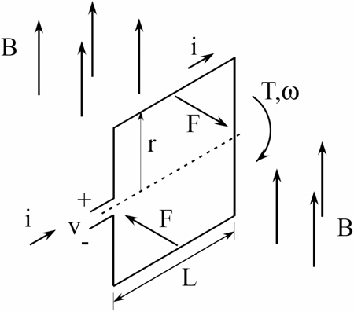

Table of contents
- [Principle term of motion](#principle-term-of-motion)
  - [Kinetic energy](#kinetic-energy)
  - [Torque](#torque)
    - [Definition of torque](#definition-of-torque)
    - [Newton's second law for rotation](#newtons-second-law-for-rotation)
  - [Basic rules](#basic-rules)
- [DC machine directory](#dc-machine-directory)
- [Induction machine directory](#induction-machine-directory)
- [References](#references)

Click :arrow_forward: icon to expand the content inside.

# Principle term of motion

    
What is kinetic energy?

## Kinetic energy

​**Kinetic energy** of an object is the energy that it possesses due to its motion.

**Rotational kinetic energy** is the energy associated with rotational motion, the same as kinetic energy in translational motion.

Every point on a rotating body has different **tangential** velocity $v_t = \omega r$. We find the equation for kinetic energy
$$
K = \frac{1}{2} m v_t ^2 = \frac{1}{2} m (\omega r)^2 = \frac{1}{2} (m r^2) \omega ^2 \quad [J]
$$

We can divide up any body into a large number of smaller masses $m_j$ and distance to the axis of rotation $r_j$
$$
K=\frac{1}{2}\left(\sum_{j} m_{j} r_{j}^{2}\right) \omega^{2} \rightarrow \frac{1}{2} m v^2 ??
$$

We want this equation in the form of kinetic energy ($\frac{1}{2} m v^2$). That is why **moment of inertia** $I$ was introduced.

$$
I = \sum_{j} m_j r_j ^2 \quad [kg \; m^2]
$$

Finally, we have
$$
K = \frac{1}{2} I \omega ^2
$$

 What is torque? 

## Torque

**Torque** is the turning effectiveness of a force, and it is illustrated here for door rotation on its hinges.

(a) A couterclockwise torque is produced by a force $\overrightarrow{\mathbf{F}}$ acting at a distance $r$ from the hingles.

(b) A smaller couterclockwise torque is produced when a smaller force $\overrightarrow{\mathbf{F ^ \prime}}$ at the same distance $r$.

(c) The same force as in (a) produces a smaller couterclockwise torque when applied at a smaller distance $r^\prime < r$ from the hingles.

(d) A smaller counterclockwise torque is produced by same **magnitude** force as (a) at the same distance $r$ but at an angle $\theta < 90$

### Definition of torque 
When a force $\overrightarrow{F}$ is applied to a point P whose position is $\overrightarrow{r}$ relative to $O$, the torque $\overrightarrow{\tau}$ around $O$ is
$$
\overrightarrow{\tau} = \overrightarrow{r} \times \overrightarrow{F}
$$

From the definiton of the **cross product**, the direction of torque is determined by **right hand** rule, and torque has magnitude
$$
|\vec{\tau}| = | \vec{r} \times \vec{F} | = r F sin \theta \quad[Nm]
$$

### Newton's second law for rotation

Recall that the magnitude of the **tangential** acceleration is proportional to the magnitude of the angular acceleration $\alpha$ by $a = r \alpha$

$$
F = ma = m r \alpha
$$

Multiple both side of above equation with $r$, we have
$$
r F = m r^2 \alpha
$$

Substitude the moment of inertia $I = m r^2$ and torque $\tau = rF$, we have
$$
\tau = I \alpha = I \frac{d \omega}{dt}
$$

 Faraday law and Lorentz law 

## Basic rules

**Faraday law** (generator action): moving coil in a magnetic field ==> electromotive force (back EMF - $\mathcal {E}$)
$$
v_{e} = 2 VBNL = 2 (\omega r)BNL
$$
or
$$
v_e = K_v \omega
$$

**Lorentz law** (motor action): magnetic field applies force to a current.

$$
F = (i \times B) L =iBL \quad (i\perp B)
$$
$$
T = 2Fr = 2 (iBNL)r
$$
or
$$
T = K_m i
$$

where
- $V$ velocity of the coil
- $N$ number of coil
- $v_e$ back EMF
- $K_m \equiv 2BNLr$ torque constant
- $K_v \equiv 2BNLr$ back EMF constant

# [DC machine directory](DC-machine/)
- Model of DC machine
- Speed control of DC machine

# [Induction machine directory](Induction-machine/)
- Model of induction machine in Stator reference frame
- Model of induction machine in Rotor flux oriented reference fram (for Field-Oriented Control)

# References
1. Moebs, W., Ling, S. J. & Sanny, J. Sep 19, 2016. University Physics Volume 1 [Online]. Houston, Texas: OpenStax. Available: https://openstax.org/books/university-physics-volume-1/pages/10-6-torque [Accessed January 28, 2022].
2. Franz Hover, David Gossard, and George Barbastathis. *2.004 Systems, Modeling, and Control II.* Fall 2007. Massachusetts Institute of Technology: MIT OpenCourseWare, [https://ocw.mit.edu](https://ocw.mit.edu/courses/mechanical-engineering/2-004-systems-modeling-and-control-ii-fall-2007). License: [Creative Commons BY-NC-SA](https://creativecommons.org/licenses/by-nc-sa/4.0/).
